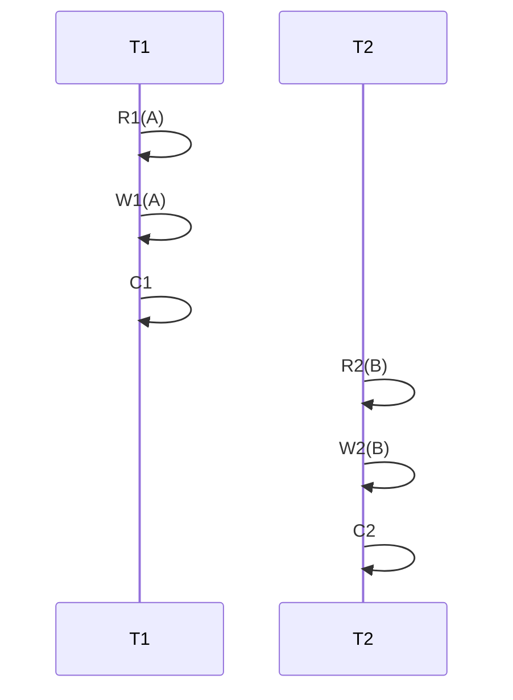
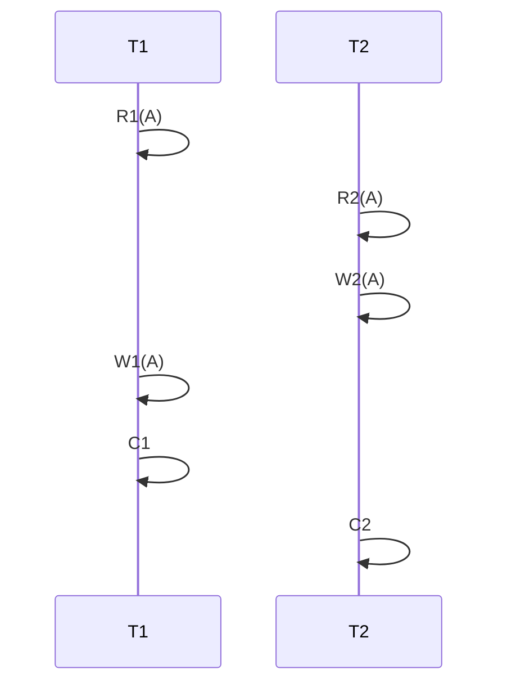
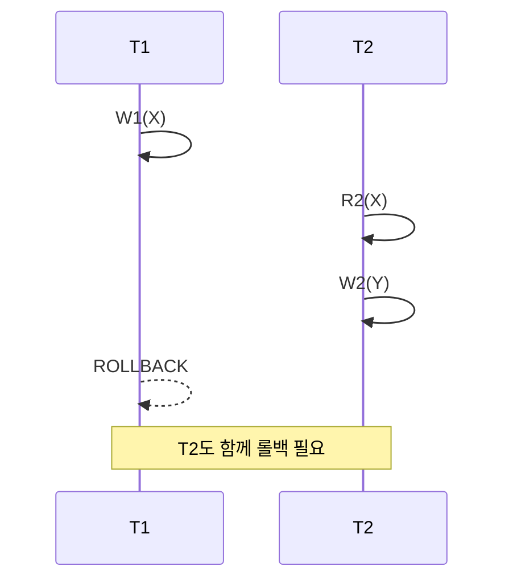

# 트랜잭션 동시 실행과 스케줄 정리

## 트랜잭션과 스케줄 개념

트랜잭션은 여러 오퍼레이션을 하나로 묶어 원자적으로 실행한다. 여러 트랜잭션이 동시에 실행될 때 각 오퍼레이션이 실제로 실행되는 순서를 **스케줄**이라 부른다. 스케줄 형태에 따라 성능과 결과 일관성이 달라진다.

---

## 시리얼 스케줄

트랜잭션들이 겹치지 않고 하나씩 순차적으로 실행된다. I/O 동안 CPU가 놀게 되어 성능이 좋지 않다. 그러나 이상한 데이터가 발생하지 않아 가장 안전하다.

```text
T1: R1(A) W1(A) C1
T2: R2(B) W2(B) C2
```



---

## 논시리얼 스케줄

트랜잭션들이 인터리빙 방식으로 겹쳐서 실행된다. 동시성이 높아 같은 시간에 더 많은 작업을 처리한다.

```text
T1: R1(A)         W1(A)           C1
T2:       R2(A) W2(A)       C2
```



논시리얼 스케줄은 처리량이 높지만 오퍼레이션 순서에 따라 **로스트 업데이트** 같은 문제가 발생할 수 있다.

---

## 오퍼레이션 간소화 표기

- `R1(K)`: 트랜잭션 1이 K 데이터를 읽는다.
- `W1(K)`: 트랜잭션 1이 K 데이터에 쓴다.
- `C1`: 트랜잭션 1이 커밋한다.

같은 트랜잭션 내부에서는 오퍼레이션 순서가 변하지 않는다.

---

## 시리얼과 논시리얼 비교 표표

| 방식     | 동시성 | 처리량 | 데이터 이상 가능성 |
| -------- | ------ | ------ | ------------------ |
| 시리얼   | 낮음   | 낮음   | 없음               |
| 논시리얼 | 높음   | 높음   | 존재               |

---

## 이상 현상 방지 방법

시리얼 스케줄과 동일한 결과를 내는 논시리얼 스케줄을 허용하면 성능과 안전성을 모두 확보할 수 있다. 이를 위해 **스케줄 동등성** 개념이 필요하다.

---

## Conflict

두 오퍼레이션이 다음을 모두 만족하면 **Conflict**라 한다.

1. 서로 다른 트랜잭션에 속함
2. 같은 데이터 항목에 접근
3. 최소 하나가 쓰기 오퍼레이션이다.

Conflict 오퍼레이션은 순서가 바뀌면 결과가 달라진다.

```mermaid
T1: R1(A) W1(A) C1
T2: R2(B) W2(B) C2

graph TD
    A["R1(A)"] --> B["W2(A)"]
    B --> C["W1(A)"]
```

---

## Conflict Equivalent

두 스케줄이 같은 트랜잭션 집합을 가지고 모든 Conflict 오퍼레이션 순서가 동일하면 **Conflict Equivalent**라 한다. Conflict Equivalent하면 결과가 같다.

## Conflict Serializable

어떤 스케줄이 특정 시리얼 스케줄과 **Conflict Equivalent**하면 **Conflict Serializable**하다고 한다. 이렇게 설계된 논시리얼 스케줄은 안전하다.

---

## Serializability와 Concurrency Control

Serializability는 스케줄이 시리얼 스케줄과 동등함을 의미한다. 실제 DBMS는 스케줄 자체를 검사하는 비효율적인 방법을 쓰지않고 **락, MVCC** 같은 Concurrency Control 프로토콜콜으로 Conflict Serializable한 스케줄만 나오도록 보장한다.

---

## 트랜잭션 롤백과 Recoverability

Rollback은 트랜잭션을 실행 전 상태로 되돌린다. 스케줄이 잘못되면 롤백백해도 일관성을 회복하지 못할 수 있다.

| 스케줄 종류   | 정의                                                 | Rollback 안전성 |
| ------------- | ---------------------------------------------------- | --------------- |
| Unrecoverable | 커밋된 트랜잭션이 롤백된 트랜잭션이 쓴 데이터를 읽음 | 위험            |
| Recoverable   | 읽은 데이터 작성 트랜잭션이 종료될 때까지 커밋 지연  | 안전            |

---

## Cascading Rollback과 Strict Schedule

**Cascading Rollback**은 하나의 트랜잭션이 롤백되면서 의존 트랜잭션이 연쇄적으로 롤백되는 현상이다.



이를 방지하려면 **Strict Schedule**을 사용한다. Strict Schedule은 커밋되지 않은 트랜잭션이 작성한 데이터를 다른 트랜잭션이 읽지도, 쓰지도 않는다. 이렇게 하면 롤백 시 연쇄 영향이 발생하지 않는다.

---

## Recoverability, Concurrency Control, Isolation 관계

Concurrency Control은 Serializability와 Recoverability를 동시에 달성한다. 격리성(Isolation)을 엄격히 적용하면 성능이 감소하므로, 필요에 따라 **Isolation Level**을 선택해 성능과 일관성 균형을 맞춘다.
