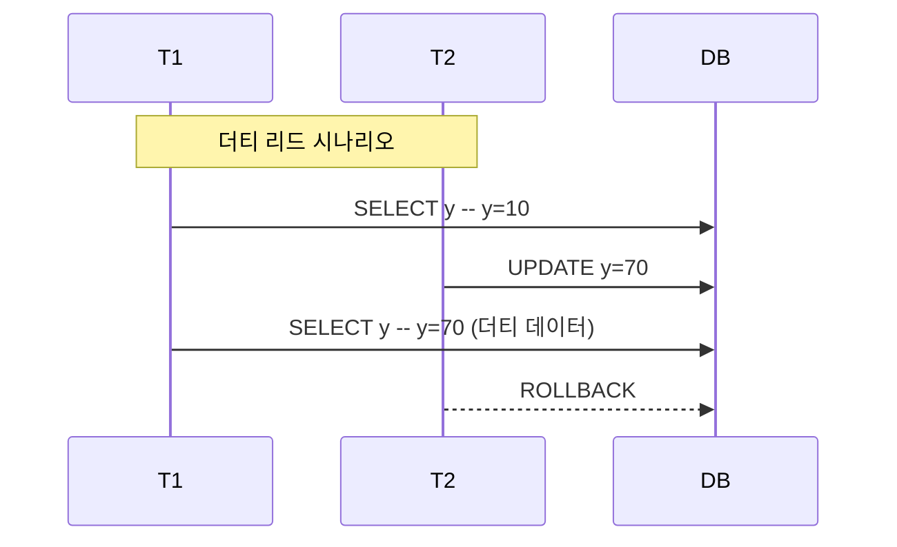
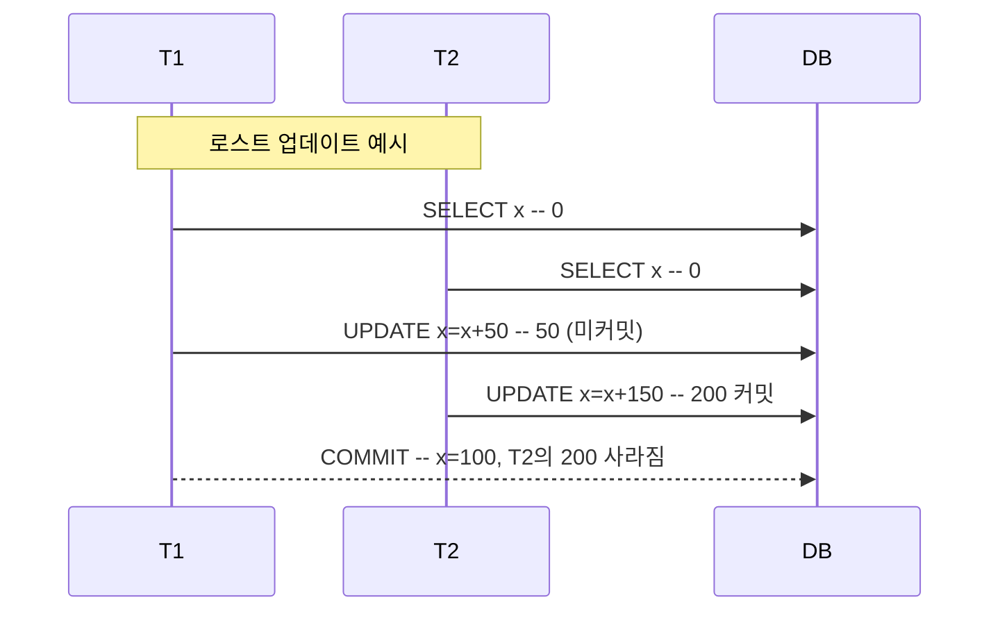

# 트랜잭션 이상 현상과 아이솔레이션 레벨 정리

## 트랜잭션 이상 현상

| 현상          | 정의                                              | 예시                                                                                                                             |
| ------------- | ------------------------------------------------- | -------------------------------------------------------------------------------------------------------------------------------- |
| 더티 리드     | 커밋되지 않은 데이터를 읽었을 때 발생한다         | T1이 x, y를 읽고 T2가 y→70으로 변경한다. T1이 y=70을 읽어 x+y=80을 계산한다. 이후 T2가 롤백되면 70은 무효가 되어 합계가 틀려진다 |
| 리피터블 리드 | 같은 데이터를 두 번 읽었는데 값이 달라진다        | T1이 x=10을 읽는다. T2가 x+40→50으로 커밋한다. T1이 다시 x를 읽으면 50이 되어 처음 값과 다르다                                   |
| 팬텀 리드     | 같은 조건으로 두 번 읽었는데 결과 집합이 달라진다 | v=10 조건 조회 시 처음엔 T1만 나왔다가, T2가 v=10으로 업데이트 후 재조회하면 T1, T2 모두 나온다                                  |



---

## SQL‑92 아이솔레이션 레벨과 허용 현상

| 레벨             | 허용 현상                           | 특징                                                  |
| ---------------- | ----------------------------------- | ----------------------------------------------------- |
| READ UNCOMMITTED | 더티 리드, 리피터블 리드, 팬텀 리드 | 가장 느슨하다. 동시성이 최고다                        |
| READ COMMITTED   | 리피터블 리드, 팬텀 리드            | 커밋된 행만 읽는다. 대부분 DBMS 기본값이다            |
| REPEATABLE READ  | 팬텀 리드                           | 같은 행을 반복 읽어도 값이 변하지 않는다              |
| SERIALIZABLE     | 허용 없음                           | 가장 엄격하다. 시리얼 스케줄과 동일한 결과를 보장한다 |

```sql
-- 예시: MySQL에서 트랜잭션 시작 시 레벨 지정
SET SESSION TRANSACTION ISOLATION LEVEL REPEATABLE READ;
START TRANSACTION;
-- 쿼리 수행
COMMIT;
```

---

## 비판과 추가 이상 현상

- **더티 라이트**: 커밋되지 않은 데이터를 다른 트랜잭션이 덮어쓴다 → 롤백 시 복구 불가
- **로스트 업데이트**: 두 트랜잭션의 갱신 중 하나가 사라진다
- **확장된 더티 리드**: 롤백이 없어도 불일치가 발생한다
- **리딩 스큐**: 관련 데이터를 순차로 읽어 불일치가 생긴다
- **라이트 스큐**: 서로 다른 컬럼을 업데이트했지만 제약을 위반한다
- **확장된 팬텀 리드**: 조건을 한 번만 읽어도 불일치가 발생한다



---

## 스냅샷 아이솔레이션(MVCC)

스냅샷 아이솔레이션은 트랜잭션 시작 시점의 **스냅샷**을 읽는다. 이후 커밋된 변경은 보이지 않는다. 동일 데이터에 대해 쓰기 충돌이 있으면 먼저 커밋한 트랜잭션만 성공하고 나머지는 Abort된다.

```mermaid
gantt
dateFormat  HH:mm:ss
section 트랜잭션
T1 읽기          :a1, 00:00:00, 5s
T2 쓰기          :a2, 00:02:00, 5s
T2 커밋          :after a2, 0s
T1 쓰기          :a3, 00:03:00, 5s
T1 커밋(충돌)    :after a3, 0s
```



```sql
-- PostgreSQL 스냅샷 아이솔레이션 사용 예시
BEGIN TRANSACTION ISOLATION LEVEL REPEATABLE READ;
SELECT * FROM account WHERE id='A'; -- 스냅샷 읽기
UPDATE account SET balance = balance + 100 WHERE id='A';
COMMIT; -- Write‑write 충돌 시 ERROR
```

---

## 주요 RDBMS 아이솔레이션 레벨 지원 현황

| DBMS         | 지원 레벨                                                                 | 특징 요약                                       |
| ------------ | ------------------------------------------------------------------------- | ----------------------------------------------- |
| MySQL/InnoDB | SERIALIZABLE, REPEATABLE READ, READ COMMITTED, READ UNCOMMITTED           | 기본값은 REPEATABLE READ(MVCC)다                |
| Oracle       | READ COMMITTED, SERIALIZABLE                                              | SERIALIZABLE이 스냅샷 아이솔레이션으로 동작한다 |
| SQL Server   | READ UNCOMMITTED, READ COMMITTED, REPEATABLE READ, SERIALIZABLE, SNAPSHOT | SNAPSHOT 레벨이 스냅샷 아이솔레이션이다         |
| PostgreSQL   | SERIALIZABLE, REPEATABLE READ, READ COMMITTED, READ UNCOMMITTED           | REPEATABLE READ가 스냅샷 아이솔레이션이다       |

---

## 실무에 어떻게 적용할까?

- 사용하는 DBMS 문서에서 레벨 의미와 구현을 확인
- 기본 레벨(READ COMMITTED 또는 REPEATABLE READ)로 시작하고, 필요 시 상향하는 방식을 추천함함
- 스냅샷 아이솔레이션에서는 커밋 충돌 예외 처리를 추가한다
- 동시성 테스트를 통해 이상 현상 발생 여부를 사전에 점검한다

---

**최종 정리**: 아이솔레이션 레벨은 성능과 일관성 사이의 절충 수단이다. SQL‑92의 세 가지 이상 현상만으로는 부족하므로, 로스트 업데이트 등 추가 현상을 이해해야 안정적인 트랜잭션 설계가 가능하다.
