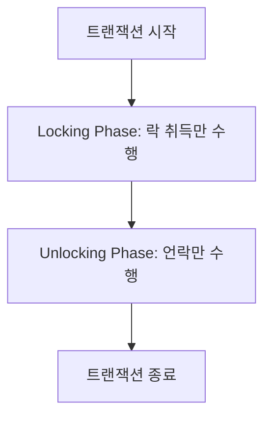
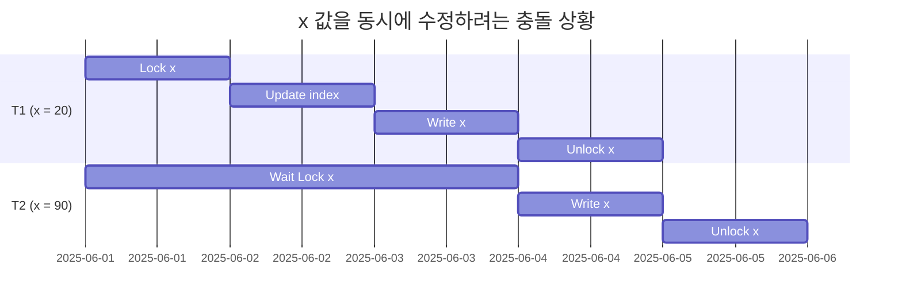
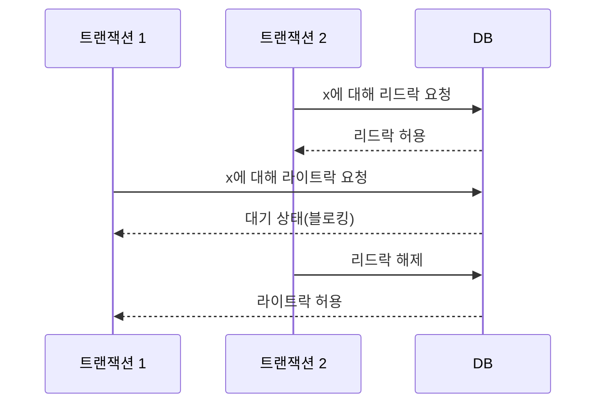
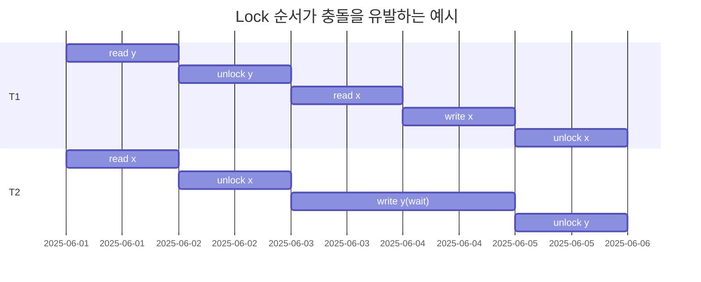
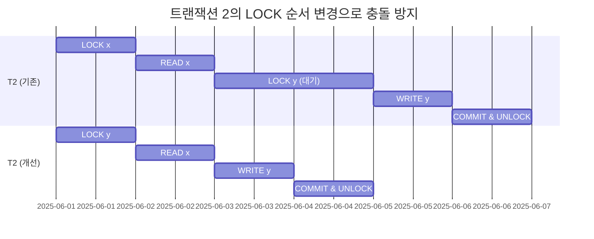
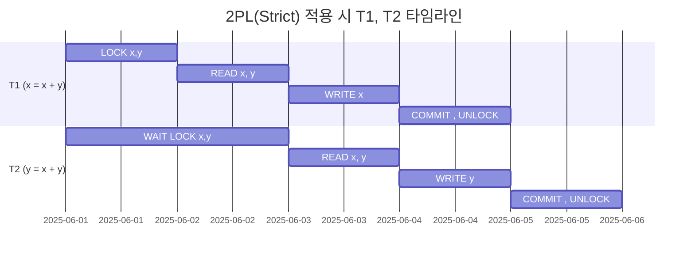
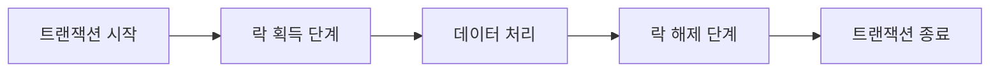

# 락(LOCK)과 2PL(두 단계 락킹)을 활용한 동시성 제어

## 락 기반 동시성 제어 개요

락은 각 데이터 항목마다 존재하며, 데이터를 읽거나 쓸 때 반드시 해당 락을 먼저 획득해야 한다. 이는 동시에 여러 트랜잭션이 같은 데이터를 접근할 때 발생하는 문제를 방지하기 위함이다.

2PL(Two-Phase Locking) 프로토콜은 트랜잭션이 모든 락을 취득한 이후에야 해제를 시작할 수 있도록 제한하여 Serializability를 보장하는 방식이다.



---

## 락을 통한 동시성 제어 문제 해결

- x 값을 20으로 변경하는 트랜잭션 1번은 내부적으로 인덱스 수정, 저장 등 복잡한 작업을 동반한다.
- 같은 시점에 트랜잭션 2번이 x를 90으로 바꾸면 충돌이 발생할 수 있다.
- 이때 락을 통해 동시에 접근하지 못하도록 막아야 데이터 정합성을 보장할 수 있다.



## 리드락과 라이트락

| 락 종류              | 특징                                 | 다른 트랜잭션과의 관계 |
| -------------------- | ------------------------------------ | ---------------------- |
| 리드락(Read Lock)    | 읽기 전용, 동시에 여러 트랜잭션 허용 | 라이트락과 충돌        |
| 라이트락(Write Lock) | 쓰기 또는 읽기용 락, 배타적          | 다른 모든 락과 충돌    |

```ts
// 리드락 획득 예시
BEGIN;
LOCK TABLE users IN SHARE MODE; -- 리드락
SELECT * FROM users WHERE id = 1;
COMMIT;

// 라이트락 획득 예시
BEGIN;
LOCK TABLE users IN EXCLUSIVE MODE; -- 라이트락
UPDATE users SET name = 'Kim' WHERE id = 1;
COMMIT;
```

---

## 리드락 vs 라이트락 충돌 예시



---

## Serializability 보장을 위한 2PL 적용 예시

- x=100, y=200일 때,
- 트랜잭션 1: x = x + y (결과: x=300)
- 트랜잭션 2: y = x + y (결과: y=300)

**문제 상황 (충돌 발생)**



#### 왜 충돌이 발생할까?

T1이 먼저 다 끝나고 T2가 실행됐다면 → x = 300, y = 500

T2가 먼저 다 끝나고 T1이 실행됐다면 → x = 400, y = 300

업데이트되지 않은 값을 읽었기 때문에 다음과 같은 결과가 나온 것

x = 300, y = 300은 어떤 순서로도 만들어질 수 없는 값이기 때문에
이 실행은 Serializability하지 않다

#### **순서 변경**



#### **2PL 적용**

1. T1이 먼저 x, y에 락을 건다.

2. T1이 커밋하기 전까지 T2는 락을 얻을 수 없어 기다린다.

3. T1이 커밋되면, T2가 x, y 락을 획득하고 자신의 연산을 수행한다.

두 트랜잭션은 동시성은 낮지만, Serializability한 결과가 보장됨.



---

## 2PL(두 단계 락킹) 프로토콜 이해

| 종류                      | 설명                              | 장점                   | 단점                |
| ------------------------- | --------------------------------- | ---------------------- | ------------------- |
| Conservative 2PL          | 모든 락을 미리 확보               | 데드락 없음            | 실용성 낮음         |
| Strict 2PL (S2PL)         | 라이트락은 커밋/롤백 시점 해제    | 리커버러빌리티 보장    | 락 보유 기간 김     |
| Strong Strict 2PL (SS2PL) | 리드락+라이트락 모두 종료 후 해제 | 구현 간단, 안정성 높음 | 병렬 처리 지연 증가 |



---

## 최종 정리

- 락은 데이터 정합성을 보장하기 위한 핵심 수단이다.
- 2PL 프로토콜을 통해 Serializability를 확보할 수 있다.
- 단순 락만으로는 충돌을 막기 어려우므로, 락 순서 조정과 프로토콜 적용이 필요하다.
- 실제 시스템에서는 MVCC와 같은 대안도 함께 고려하여 성능과 안정성을 모두 확보해야 한다.
