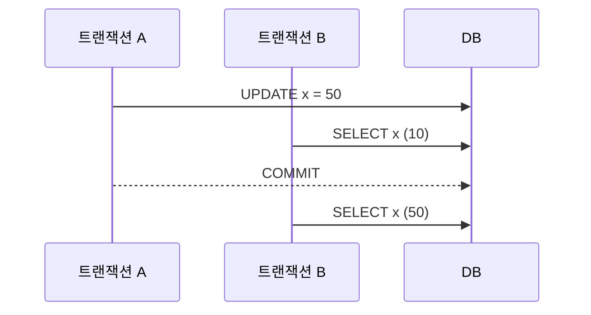
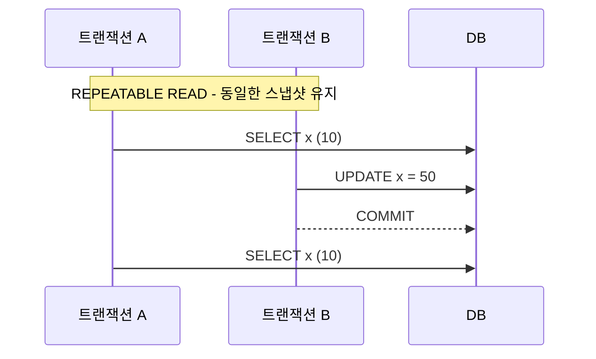
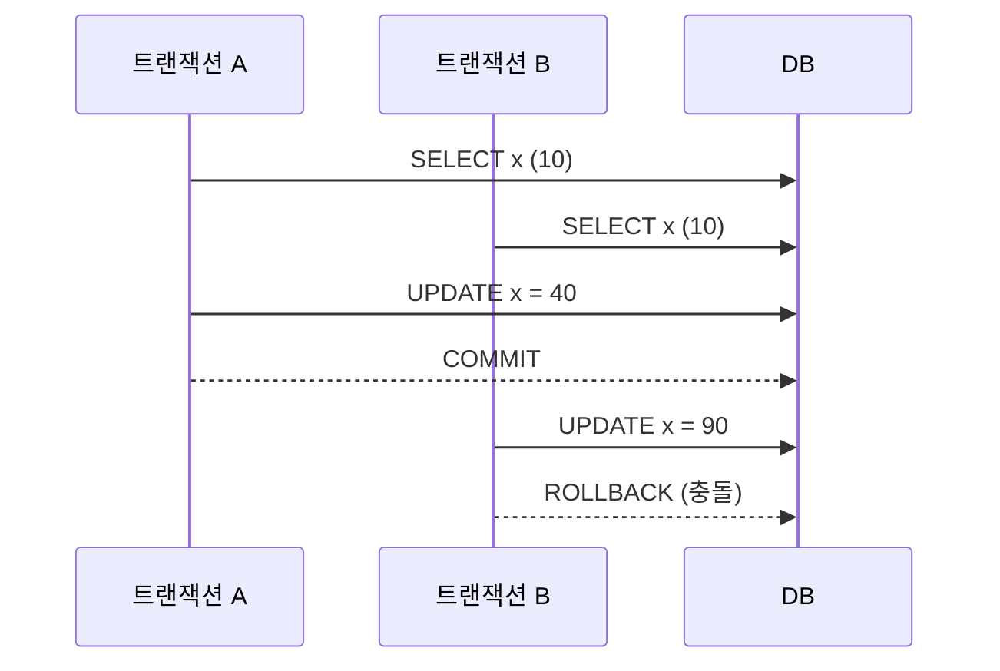
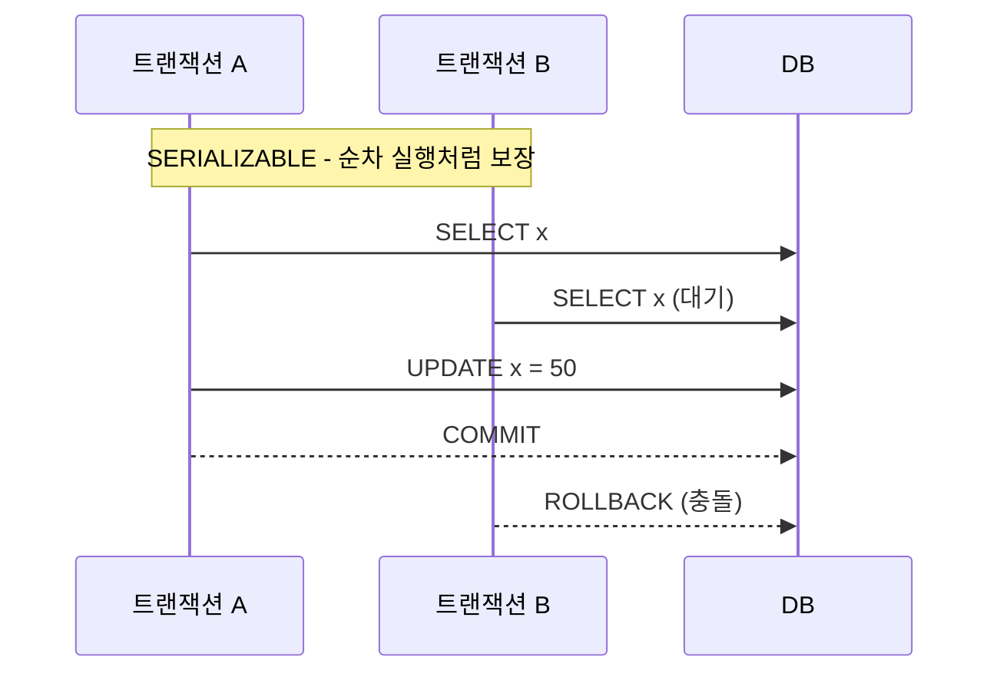

## MVCC란?

### 락(Lock) 기반 동시성 제어와의 비교

- 락 기반 동시성 제어:

  - 같은 데이터에 대해 READ - READ는 허용하지만, 그 외의 경우에는 모두 허용하지 않는다.
  - 한쪽 트랜잭션이 실행 중일 때 다른 한쪽은 블락되어 대기하므로, 동시 처리량이 줄어들어 성능에 안 좋은 영향을 미칠 수 있다.
  - RDBMS가 내부적으로 락을 획득하고 해제하는 방식으로 동작하며, 락은 복구 가능성을 위해 커밋 시점까지 유지된다.

- MVCC 기반 동시성 제어:

  - 같은 데이터에 대해 WRITE - WRITE하는 경우에는 한쪽이 블락되지만, 그 외의 경우에는 블락되지 않고 동시에 처리가 가능하다.
  - 이로 인해 동시에 처리할 수 있는 트랜잭션 처리량이 증가하여 성능 향상에 장점이 있다.
  - 대부분의 RDBMS는 MVCC를 사용하여 동시성을 구현한다.

### MVCC의 주요 특징

- 커밋된 데이터만 읽는다.

  - 트랜잭션이 데이터를 변경해도 해당 변경 내용은 바로 데이터베이스에 반영되지 않고, 자신의 트랜잭션만 알 수 있는 공간에 쓰여진다.
  - 다른 트랜잭션이 READ를 할 때는 데이터베이스에 이미 커밋된 값을 읽는다.
  - 트랜잭션이 COMMIT되면 비로소 변경된 값이 데이터베이스에 반영된다.

### MVCC의 장점 및 단점

- 장점: WRITE 중에도 READ 가능하며, READ 중에도 WRITE 가능하여 락 기반 방식보다 블로킹이 적고 동시 처리량이 증가해 성능이 향상된다.
- 단점: 데이터 변화 이력을 관리해야 하므로 추가적인 저장 공간이 필요하다.

---

## MVCC와 격리 수준(Isolation Level)

MVCC는 데이터를 읽을 때 특정 시점 기준으로 가장 최근에 커밋된 데이터를 읽는다. 이 시점은 격리 수준에 따라 달라진다.

### READ COMMITTED

- 데이터를 READ하는 시점을 기준으로 그 전에 커밋된 데이터를 읽는다. SELECT 쿼리마다 최신 커밋 스냅샷을 읽는다.
- MySQL과 PostgreSQL 모두 동일하게 동작한다.

### REPEATABLE READ

- 트랜잭션 시작 시간을 기준으로 그 전에 커밋된 데이터를 읽는다. 트랜잭션이 시작되면 해당 시점의 데이터 스냅샷을 유지하며, 트랜잭션이 끝날 때까지 동일한 데이터를 읽게 됨

> MySQL에서는 두 격리 수준을 Consistent Read라고 부름.

#### Consistent Read

- 특정 시점 기준으로 커밋된 데이터를 읽는 방식
- READ COMMITTED, REPEATABLE READ에서 사용

#### Lost Update

PostgreSQL은 충돌 시 롤백("**First Update Wins**"). MySQL은 SELECT ... FOR UPDATE 같은 **락킹 리드(Locking Read)**를 명시적으로 사용

##### 락킹 리드

- SELECT 실행 시 락을 획득하는 방식
- SELECT ... FOR UPDATE: WRITE LOCK 획득
- SELECT ... FOR SHARE: READ LOCK 획득
- MySQL에서는 Locking Read 시점에 최신 커밋된 데이터를 읽는다

### SERIALIZABLE

- 가장 강력한 격리 수준으로, 모든 이상 현상을 방지한다.

##### MySQL

- MVCC보다는 락 기반으로 동작
- 트랜잭션 내의 모든 일반 SELECT 문이 암묵적으로 SELECT ... FOR SHARE처럼 동작함. 즉, READ 시에 공유 락(Shared Lock)을 획득합니다.
- FOR UPDATE가 아닌 FOR SHARE를 사용하는 것은 성능을 고려한 것이지만, FOR UPDATE에 비해 데드락 발생 가능성이 높을 수 있다.

##### PostgreSQL

- SSI (Serializable Snapshot Isolation) 기법으로 구현
- MVCC 기반으로 동작하며 모든 이상 현상을 막아줌
- "First Committer Winner" 방식으로 동작

---

## MVCC 구현의 RDBMS별 차이점

- MVCC 구현은 DBMS마다 차이가 있음
- 개념 이해 위주 설명이며, 실제 상황에 따라 다르게 동작할 수 있음
- 사용하는 DBMS의 공식 매뉴얼을 반드시 확인할 것
